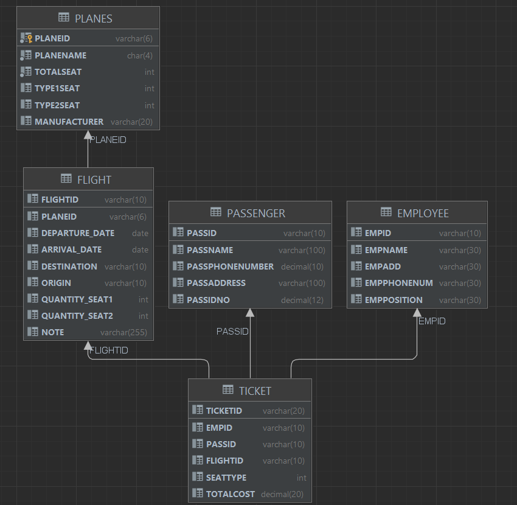
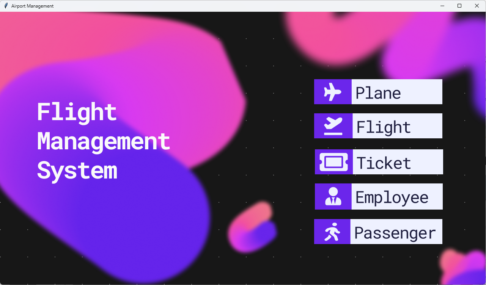
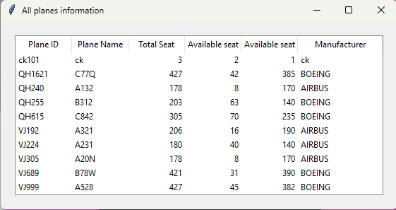
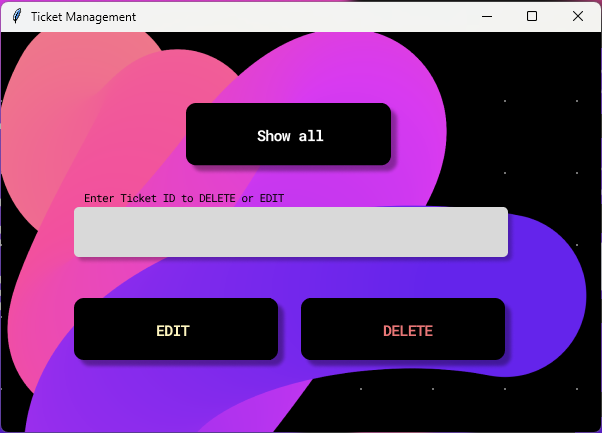
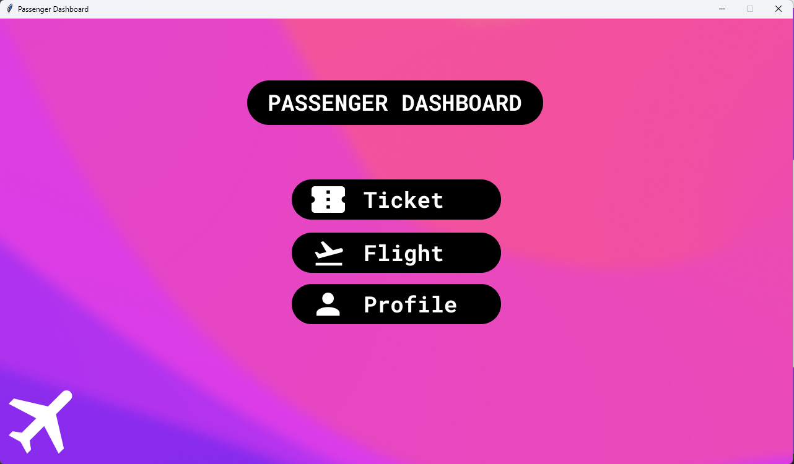
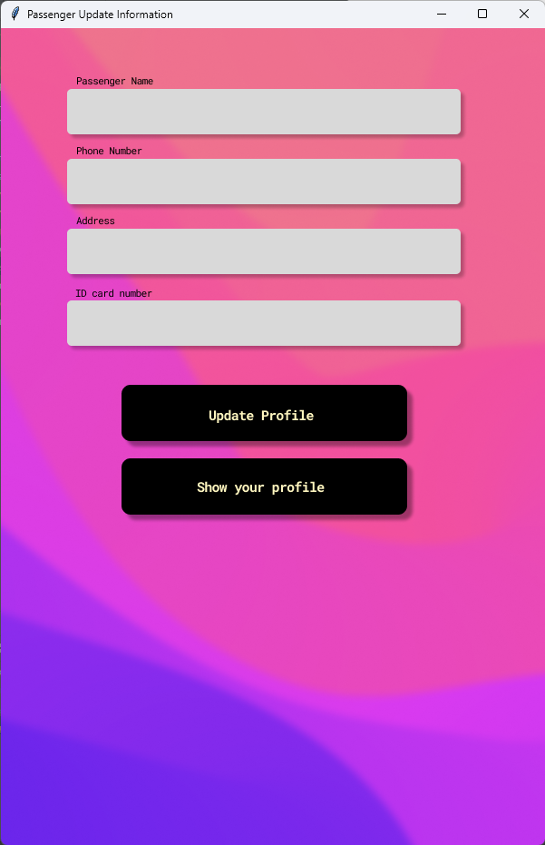

# Project course Principle of DBMS
## Flight Management System

### 0. General
* The project is a part of the course Principle of DBMS in College
of Information and Communication Technology, Can Tho University.
* Developed by 3 students:
  * Le Phuong Trung B2005900
  * Ngu Cong Khanh B2012022
  * Nguyen Hoang Dang Huy B2014915
* Database is powered by Railway.app using MySQL database, we will stop the service after finishing
the report for the lecturer, avoiding service charge.
* Please use this as a reference only.
> *main.py* is our first version of this, and it only runs 
on console, no UI available.

> The main function codes of the project are mainly located in *login.py, booking.py, 
> FlightUI.py, passengerdashboard.py and init_db.sql*.
* __*Stored procedures or functions:*__
  * We have 1 stored procedure coded in SQL to 
  automatically fill in the number of available
  seat on newly added flights, see more in *init_db.sql*

* __*Lists of functions:*__
  1. Login as employee 
  2. Login as passenger 
  3. Create ticket transaction 
  4. Rollback ticket transaction
  5. Add information of planes
  6. Delete information of planes by planes ID
  7. Update information of planes
  8. Show information of planes
  9. Add information of flights
  10. Delete information of flights by flights ID
  11. Update information of flights
  12. Show information of flights
  13. Add information of employees 
  14. Delete information of employees by employee ID
  15. Update information of employees
  16. Show information of employees
  17. Add information of passengers
  18. Delete information of passengers by pax ID
  19. Update information of passengers
  20. Show information of passengers
  21. Delete information of tickets by tickets ID 
  22. Update information of tickets
  23. Show information of tickets
  24. Some other functions were coded in Python:
      1. Authenticating users
      2. Routing users to their correct dashboards
      3. Generating ticket ID
      4. Usable and friendly UI
***

### 1. Installation
* Download full source code [here](https://github.com/AlexHoop140/Project-Principle-DBMS/archive/refs/heads/main.zip).
* The project using 100% Python with tkinter for UI and mysql connector
for database.
* Install dependencies at *requirement.txt*.
* You can use local mysql to connect to database.
***

### 2. Instruction
1. After install, run __*login.py*__
2. Typing in ID and password
3. If you are an employee, tick the __*checkbox*__
4. Else, typing passenger and passenger's password  
  > Remember to add a "0" before the password sequence when typing in passenger
  > password, due to dummy database design :v

  > ID is the employee ID or passenger ID, password is the phone number.
6. Using provided functions as normal
***

### 3.  Database Design

***

### 4.  User Interfaces
#### 1. Login Screen

***
#### 2. Employee dashboard and related screens
##### 2.0 Employee dashboard

***
###### 2.1.0 Employee planes management

***
###### 2.1.1 Employee planes show all planes

***
###### 2.2.0 Employee flights management 
***

***
###### 2.3.0 Employee passengers management 

***
###### 2.4.0 Employee tickets management 

***
###### 2.5.0 Employee management 

***
#### 3 Passenger dashboard and related screens
##### 3.1 Passenger dashboard

***
##### 3.1 Passenger booking screen

***
##### 3.2 Passenger flights info

***
##### 3.3 Passenger update info screen

***
##### 3.4 Passenger info

